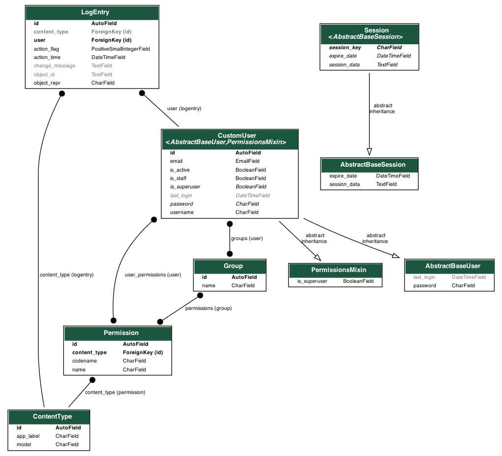

# Django

Attention: 最終更新日 2021/01/26


## データベースからデータを出力したり読み込んだりする
- プロジェクト直下にfixturesディレクリを作成

  ```
  PROJECT_NAME
    |-APP_NAME
    |-fixtures # 新規作成
  ```

- dumpdata

  データベースからファイル

  ```
  $ python manage.py dumpdata APP_NAME > fixtures/dump_data.json
  ```

  特定のモデルだけ

  ```
  $ python manage.py dumpdata APP_NAME.MODEL_NAME > fixtures/dump_data.json
  ```

- loaddata

  ファイルからデータベース

  ```
  $ python manage.py loaddata fixtures/post_test.json   
  ```

- テストデータ
  
  https://www.json-generator.com/
  
  ```
  [
    '{{repeat(100, 10000)}}',
    {
      model: "management.post",
      pk: '{{index()}}',
      
      fields: 
        {
          weight: '{{floating(60.00, 85.00, 2)}}',
          date: '{{date(new Date(2019, 0, 0), new Date(2021, 1, 0),   "YYYY-MM-ddThh:mm:ssZ")}}'
        }
    
    }
  ]
  ```


## DjangoのmodelからER図を作成する

- インストール
  
  ```
  $ brew install Graphviz

  $ pip install pygraphviz
  $ pip install django-extensions
  ```

- ER図作成

  ```
  $ python manage.py graph_models -a -o er.png
  ```

- 出力結果

    

  他、Appごとだったり出力の拡張子を変えたりもできるっぽい。